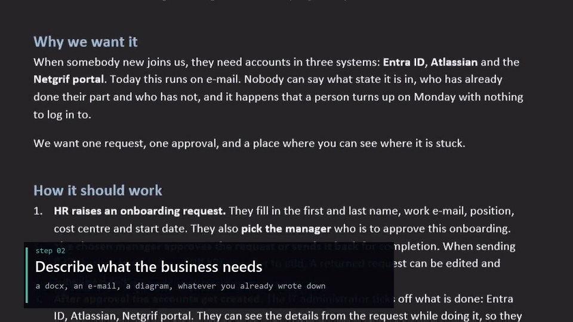

# Describe a business process. Your AI assistant turns it into a running app.

[](https://codespaces.new/lubospetrovic13/etask-app)
[](https://vscode.dev/redirect?url=vscode%3A%2F%2Fms-vscode-remote.remote-containers%2FcloneInVolume%3Furl%3Dhttps%3A%2F%2Fgithub.com%2Flubospetrovic13%2Fetask-app)
[](docs/DEVELOPER.md#one-click-if-you-already-have-claude-code)

**eTask** is a starter on the [Netgrif](https://netgrif.com) platform. Login, roles,
permissions, forms, task lists, the portal and the database already run. Your AI assistant
writes only the business process, as a Petriflow model, and it becomes a working
application in the portal.



<sub>A Word document from HR went in unedited. A few minutes later HR raises a request, the
manager approves it and IT ticks off the accounts. [Full video](https://claude.ai/artifact/Nfms7SUMAAuejGeVf7aLnb)</sub>

## 1. Start Netgrif

You need [Docker Desktop](https://www.docker.com/products/docker-desktop/) and Git.

```bash
git clone https://github.com/lubospetrovic13/etask-app.git
cd etask-app
docker compose up -d
```

Already have it on your machine? From its folder, just:

```bash
docker compose up -d
```

Or open the folder in **IntelliJ IDEA** or **VS Code**, open `compose.yaml` and click the
green ▶ next to `services:`.

The first start builds the images, which takes about ten minutes. After that it is under two.
When `docker compose logs -f setup` prints `eTask is running`, open
**http://localhost:4200** and sign in as `super@netgrif.com` / `password`.

## 2. Describe your business problem

Open the same folder in your AI assistant: Claude Code, Cursor, GitHub Copilot, Codex,
Gemini CLI or Windsurf. The rules for the platform are already in the repository
(`AGENTS.md`, `CLAUDE.md`), so there is nothing to configure. Then tell it what your business
needs, the way you would tell a colleague:

> We need an app for **[your process]**. **[Who]** starts it and fills in **[what]**.
> **[Who]** approves it, and if they send it back, **[what happens]**. After approval
> **[who]** does **[what]**. Everyone should see where each request is stuck.
> Build it on this platform and prove it runs in the engine before you tell me it is done.

A Word document, an e-mail or a diagram you already have works too. The one from the video
is [`examples/onboarding/request.md`](examples/onboarding/request.md).

## What it is good for

**A good fit:** any process where people, steps, decisions and documents meet, inside a
company or open to its customers and partners, from a single agenda up to the backbone of
a whole organisation:

- **Requests and approvals**, where someone asks, someone decides and everyone sees the state
- **Case handling**, where a case moves through several teams until it is resolved
- **Forms with a back office**, where a customer, citizen or partner fills in a form and staff process it
- **Contracts and documents**, from intake and review to signature and archive
- **Portals** for customers, partners or field staff, each seeing only their own work
- **Service desks and ticketing**, with queues, deadlines and escalation
- **Orchestration** of people and existing systems into one task list

Anything that is today a spreadsheet, an e-mail thread or a shared folder with rules nobody
wrote down is a candidate.

**Not a good fit:** consumer mobile apps, games, marketing websites, design-first custom UIs,
real-time analytics or streaming data. The platform draws the screens from the process, so
if the screen *is* the product, this is the wrong tool.

**Licence:** the Community Edition is free and source-available, not open source. See
[Licensing](#licensing).

## More

Other ways to run it, the AI assistants in detail, adding and verifying an app, and what to
do when it does not start: [docs/DEVELOPER.md](docs/DEVELOPER.md).

## Licensing

`etask-backend-starter` and `etask-frontend-starter` are covered by the **NETGRIF Community
License v1.0** (`etask-backend-starter/LICENSE.txt`). Read it before using this
commercially. The configuration, the nets and the tooling in this repository carry no
licence of their own yet.
