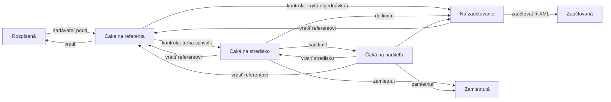

# Faktúry a objednávky: nástrel z dokumentu kolegov

**Zdroj:** dokument *Faktúry a objednávky* (aplikácia pre spracovanie a schvaľovanie faktúr,
aplikácia pre spracovanie objednávok, integrácie). **Stav:** nástrel na vetve
`app/faktury-objednavky`, postavený nad príkladom `examples/objednavky-faktury`, overený na
bežiacom engine (`sccheck` 234/0, `fakcheck` 35/0 na čistej databáze).

Tento súbor je popis appky **ľudskou rečou**. Má sa dať prečítať bez XML a má sa podľa neho
dať povedať „áno, toto chceme“ alebo „nie, schvaľuje niekto iný“. Pri každej časti je
napísané, či je v nástrele hotová, alebo čo chýba.

---

## Čo appka robí

Faktúra prejde od prijatia cez kontrolu referentom, párovanie s objednávkou a schvaľovanie až
po zaúčtovanie a export. Objednávka prejde od žiadosti cez schválenie po objednanie. Vždy je
vidno, **u koho práve leží** a **kto čo kedy rozhodol**.

## Roly

| rola | čo robí |
|---|---|
| zadávateľ | zapíše faktúru alebo požiada o objednávku |
| **referent** *(nové)* | skontroluje vyťažené údaje, doplní chýbajúce, spáruje faktúru s objednávkou, zapíše dodanie |
| schvaľovateľ strediska | schvaľuje faktúry a objednávky svojho strediska |
| riaditeľ | schvaľuje nad limit |
| účtovník | zaúčtuje schválenú faktúru |
| správca (admin) | limit a schvaľovatelia v karte *Nastavenia* |

## Faktúra krok za krokom

**Každý krok je rozdelený na polovice:** vľavo údaje faktúry, vpravo faktúra sama (PDF,
sken alebo XML e-faktúra). Pri zápise sa do pravej polovice faktúra nahrá (pretiahnutím
alebo kliknutím), v ďalších krokoch sa s ňou porovnáva, bez sťahovania a prepínania okien.

**Obrazovka:** vľavo sekcie *Dodávateľ, Faktúra, Zaradenie*; to, čo sa v kroku rozhoduje,
je hneď pod hlavičkou a lišta s tlačidlom je pripnutá dole. Vstupné kontroly sú farebné
štítky. Keď referent ukáže myšou na pole, jeho hodnota sa vo faktúre zvýrazní (PDF s textom
a XML). Hranica medzi formulárom a faktúrou sa dá potiahnuť. Popisy polí sú v ikonke ⓘ.

**Jazyk:** portál je predvolene v angličtine, slovenčina je v prepínači. Texty, ktoré
appka do faktúry zapisuje (priebeh, vstupné kontroly, výsledok načítania, e-maily), sú
v jazyku, v ktorom bola faktúra založená. Chybové hlášky sú v jazyku toho, kto ich číta.



1. **Zadávateľ** zapíše faktúru v portáli. Ak má prílohu (XML e-faktúru, PDF, sken),
   *Načítať z prílohy* vyplní polia sám. E-faktúra sa číta presne, PDF podľa popiskov, sken
   cez OCR. Podá na kontrolu.
2. **Referent** *(nové)* dostane faktúru do fronty *Faktúry na kontrolu*. Vidí **vstupné
   kontroly**: chýbajúca príloha, IČO alebo IBAN, dátum vystavenia v budúcnosti, splatnosť
   pred vystavením, chýbajúca objednávka, faktúra drahšia ako objednávka. Kontroly faktúru
   nezastavia, rozhodne referent. Doplní údaje, **spáruje s objednávkou** a zapíše
   **dodanie**: kompletne, čiastočne alebo nedodané. Potom buď pokračuje, alebo vráti
   zadávateľovi s dôvodom.
3. Systém podľa pravidla rozhodne, **či treba schvaľovať** (pozri Pravidlá).
4. **Stredisko**, prípadne **riaditeľ** nad limit, schváli, zamietne alebo vráti. Vrátiť
   sa dá na **ktorúkoľvek predošlú úroveň** *(nové)*: zadávateľovi, referentovi, a riaditeľ
   aj stredisku. Pri vrátení a zamietnutí je dôvod povinný.
5. **Účtovník** zaúčtuje s číslom dokladu, alebo vráti referentovi či zadávateľovi. Pri
   zaúčtovaní sa pripraví **XML pre účtovný systém** *(nové)*.

## Objednávka krok za krokom

1. Zadávateľ napíše, čo treba, a pridá položky. Cena sa počíta zo súčtu.
2. Stredisko schváli, nad limit aj riaditeľ.
3. Zadávateľ potvrdí objednanie číslom objednávky. Na toto číslo sa potom párujú faktúry.

## Pravidlá

* **Štvoro očí.** Kto faktúru zapísal, ten ju neschvaľuje.
* **Schvaľovatelia podľa strediska.** Ak stredisko nemá vlastného schvaľovateľa, ide to
  všetkým schvaľovateľom, a ak ani tých niet, riaditeľovi. Každý taký krok sa zapíše do
  priebehu.
* **Limit riaditeľa** (predvolene 1 000 € s DPH) sa mení v karte *Nastavenia* bez novej
  verzie procesu.
* **Schvaľovanie netreba** *(nové, PREDPOKLAD)*: faktúra, ktorá je krytá **už schválenou**
  objednávkou, bola **dodaná kompletne** a **nie je drahšia** ako objednávka, ide rovno na
  zaúčtovanie, lebo peniaze sa raz schválili už na objednávke. V ostatných prípadoch sa
  schvaľuje.
* Každá zmena stavu pošle e-mail tomu, kto je na rade, a zapíše sa do priebehu.

## Čo je v nástrele a čo chýba

| z dokumentu | stav |
|---|---|
| ručné zadanie cez GUI s OCR nahraného súboru | **hotové** (už v príklade) |
| e-faktúra neprechádza cez OCR | **hotové**: XML sa číta, nehádá sa |
| vstupná validácia (typ, dátum, existencia objednávky) | **v nástrele**: vstupné kontroly u referenta |
| úloha pre tím referentov, kontrola a doplnenie údajov | **v nástrele** |
| párovanie faktúry na objednávku | **hotové** (výber zo schválených objednávok, porovnanie súm) |
| dodanie kompletné / čiastkové / nedodané | **v nástrele za celú faktúru**; po položkách chýba, lebo faktúra zatiaľ nemá položky |
| pravidlo, či treba schvaľovať | **v nástrele** ako predpoklad vyššie |
| schvaľovatelia z konfigurovateľnej matice | **čiastočne**: stredisko → schvaľovatelia a limit sú v *Nastaveniach*; viacrozmerná matica (suma × stredisko × typ) chýba |
| dynamické doplnenie chýbajúceho schvaľovateľa | **čiastočne**: kaskáda na zálohu; ručné doplnenie konkrétnej osoby chýba |
| viac schvaľovacích kôl, vrátenie na predošlé úrovne | **v nástrele** (referent, stredisko, riaditeľ, účtovník) |
| e-mailové notifikácie | **hotové** |
| export XML pre účtovný systém | **v nástrele**: XML sa pripraví; tvar je návrh |
| sprievodný list v PDF | chýba, pozri nižšie |
| pravidelné reporty | chýba |
| pripomienky a eskalácie, keď úloha dlho stojí | chýba |
| dashboard s kartami a počtami | **hotové** v platforme (karty, počítadlá, zobrazenia podľa stavu) |
| objednávky: drafty, viac úrovní, dynamický schvaľovateľ | **čiastočne**: draft a dve úrovne áno, dynamický schvaľovateľ nie |
| objednávky: evidencia dodávok a párovanie faktúr na ne | chýba, ďalší krok |
| objednávky zo sieťového disku (XML) alebo z e-mailu | chýba, pozri nižšie |
| archivácia objednávky po potvrdení dodania | chýba, pozri nižšie |

### Čo sa v Petriflow postaviť nedá: chýbajúce primitíva

Toto sú integrácie. Podľa pravidiel repozitára ku každej patrí veta, **ktoré primitívum na
vyššej vrstve chýba**. Každé by bola nová metóda v `EtaskActionDelegate` (vrstva 2), volateľná
z ľubovoľnej siete.

| potreba | chýbajúce primitívum |
|---|---|
| faktúry z e-mailu (IMAP) | akcia nevie otvoriť IMAP schránku ani sa spustiť periodicky; chýba `nacitajPostu(schranka)`, ktorá z každej správy s prílohou založí case, plus plánovač |
| faktúry a objednávky zo sieťového priečinka | akcia nevie čítať priečinok mimo kontajnera; chýba `nacitajPriecinok(cesta, maska)` |
| e-poštár cez REST | chýba všeobecné `zavolajRest(adresa, telo)` s konfiguráciou prihlasovania mimo siete |
| dodávateľ podľa IČO (účtovný systém, ORSR, ORČR) | chýba `dodavatelPodlaIco(ico)`, ktoré vráti názov, adresu a IBAN |
| odoslanie XML do účtovníctva a spätná synchronizácia | chýba `odosliDoUctovnictva(xml)` a spätné volanie, ktoré case posunie, keď účtovníctvo potvrdí |
| archív cez SOAP/REST | chýba `archivuj(case, subory)` |
| sprievodný list v PDF | engine vie PDF z formulára, ale nie zo šablóny dokumentu; chýba `pdfZoSablony(sablona, data)` |
| pripomienky a eskalácie | akcia sa nevie spustiť sama o X dní; chýba plánovač úloh nad casmi (`pripomenPo(dni)`) |
| pravidelné reporty | chýba plánovač a export zobrazenia do súboru |

## Predpoklady, ktoré treba potvrdiť

1. **Pravidlo „schvaľovanie netreba“** je naše, nie z dokumentu. Dokument hovorí len
   „podľa naprogramovaných pravidiel“. Aké sú skutočné pravidlá?
2. **Referent kontroluje každú faktúru**, aj e-faktúru. Dokument hovorí „v prípade
   papierových faktúr“. Má e-faktúra kontrolu preskočiť, ak má objednávku?
3. **Dodanie za celú faktúru** stačí na začiatok, po položkách neskôr?
4. **Kto smie vrátiť na ktorú úroveň:** v nástrele môže každý vrátiť na hociktorú predošlú.
   Je to tak správne, alebo sa vracia vždy len o jednu úroveň?
5. **Tvar XML pre účtovníctvo** je návrh. Aký účtovný systém a aký formát?

## Ako to vyskúšať

Na vetve `app/faktury-objednavky` je appka aktívna. Po `docker compose up -d --build` je
v portáli karta *Objednávky a faktúry*. Testovacie účty a roly sú v `ai-config/seed.json`:
referentom je `super@netgrif.com`. Overenie:

```bash
cd ai-config
python3 tools/sccheck.py     # pôvodné správanie appky, s krokom referenta
python3 tools/fakcheck.py    # to, čo pridal nástrel
```
